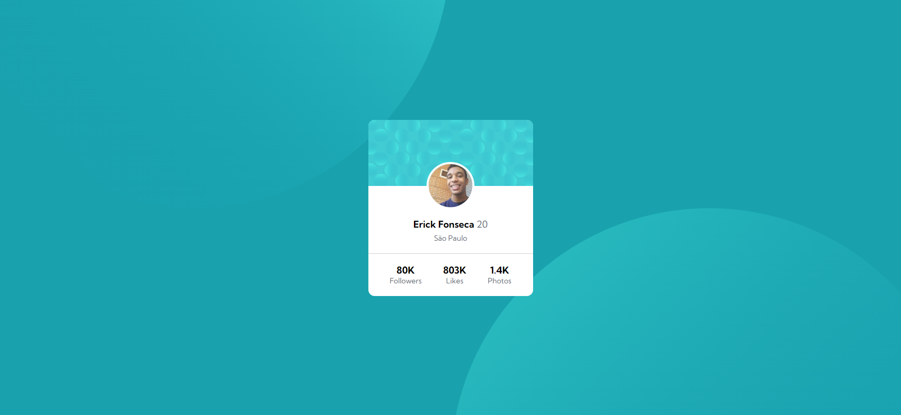
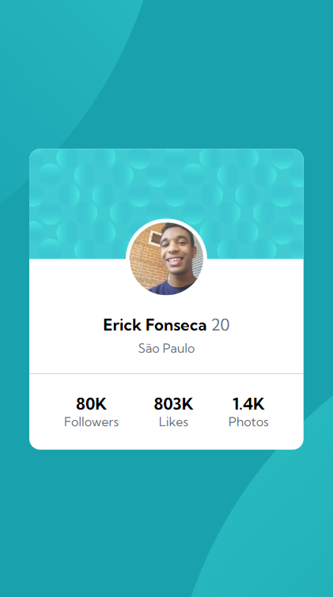

# Frontend Mentor | Profile card component
Esta é uma solução para o desafio Profile card component no Frontend Mentor, o objetivo principal é criar um cartão que contenha informações de perfil.

## Índice

- Design
- Links
- Tecnologias utilizadas

## Visão geral

### Design desktop 🖥️

### Design mobile 📱

## Links

- Desafio do Frontend Mentor: [Profile card component](https://www.frontendmentor.io/challenges/profile-card-component-cfArpWshJ)

## Tecnologias utilizadas

- HTML
- CSS
